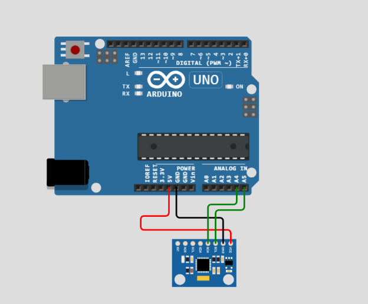

# MPU_6050  

MPU 6050 is a device for measure acceleration and angular velocity and can be used in many applications like giving feedback to the main microcontroller

## main parts of the program

### initialization the mpu
To initialize the MPU-6050, we need to use the Wire library to communicate with the device via I2C protocol. We need to set the power management register (PWR_MGMT_1) to 0x00, which means:
- No device reset
- No sleep mode
- No cycle mode
- Temperature sensor enabled
- Internal 8MHz oscillator as clock source

The following code shows how to initialize the MPU-6050:

        void mpu_init(){
        /*
        Register           | 7            | 6     | 5     |   4   |     3    | 2 | 1 | 0 |
        PWR_MGMT_1 (0x6B)  | DEVICE_RESET | SLEEP | CYCLE |   -   | TEMP_DIS | CLKSEL[2:0]
        */
        Wire.beginTransmission(mpu_address);
        Wire.write(PWR_MGMT_1_register);
        Wire.write(0x00); //0b0000 0000
        Wire.endTransmission();
        }

### gyroscope configuration

To configure the gyroscope, we need to set the full scale range to ±250 deg/s, which is the default value. This means that the gyroscope can measure rotational velocities up to ±250 degrees per second. To do this, we need to write 0x00 to the gyroscope configuration register (GYRO_CONFIG), which means: 
- No self-test for X, Y, and Z axes
- Full scale range of ±250 deg/s

|Register           | 7     | 6     | 5     |    4 & 3    | 2 | 1 | 0 |
|-------------------|-------|-------|-------|-------------|---|---|---|
|GYRO_CONFIG (0x1B) | XG_ST | YG_ST | ZG_ST | FS_SEL [1:0]| - | - | - |

| FS_SEL | Full Scale Range |
|--------|------------------|
| 0      | +-250 deg/s      |
| 1      | +-500 deg/s      |
| 2      | +-1000 deg/s     |
| 3      | +-2000 deg/s     | 

The following code shows how to configure the gyroscope:

        void mpu_gyroconfig(){
        Wire.beginTransmission(mpu_address);
        // deploying gyroscope to be able to read it
        Wire.write(GYRO_CONFIG);
        
        // now we set the full scale range to +-250 deg/s (from data sheet also) 
        /*
        Register           | 7     | 6     | 5     |   4  |   3   | 2 | 1 | 0 |
        GYRO_CONFIG (0x1B) | XG_ST | YG_ST | ZG_ST | FS_SEL [1:0] | - | - | - |
        
        | FS_SEL | Full Scale Range |
        |--------|------------------|
        | 0      | +-250 deg/s      |
        | 1      | +-500 deg/s      |
        | 2      | +-1000 deg/s     |
        | 3      | +-2000 deg/s     |  
        */

        //!!!!any change to this config should appear in the map in finding yaw
        Wire.write(0x00);// 0b0000 0000
        Wire.endTransmission();

        }

### getting yaw reading

To get the yaw reading, we need to read two bytes from the gyroscope Z-axis output registers (GYRO_ZOUT_H and GYRO_ZOUT_L). The first byte is the high byte and the second byte is the low byte. We need to combine them into a 16-bit signed integer using bitwise operations. Then, we need to map the raw value to the corresponding angular velocity in degrees per second using the map function. The following code shows how to get the yaw reading:

        int16_t mpu_read2bytes_yaw(){
        int16_t data = 0;
        double real_data;

        Wire.beginTransmission(mpu_address);
        Wire.write(GYRO_ZOUT_H);
        Wire.endTransmission();
        
        Wire.requestFrom(mpu_address , 2);
        
        while(Wire.available() < 2);

        // write.read() gives you 1 byte 
        // 1byte (e.g. 0x1B)<< 8 | 1byte (e.g. 0x0F) ==> combinig the 2 digits (e.g. 0x1B0F)
        data = Wire.read() << 8 | Wire.read();
        
        // according to the config
        real_data = map (data , -32767 , 32766 , -250 , 250);
        return real_data;
        }

## Simulation (press the image 😉)

### WOKWI

