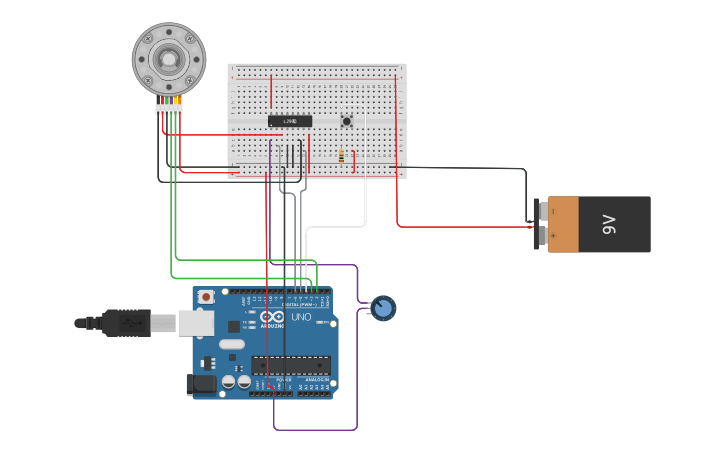
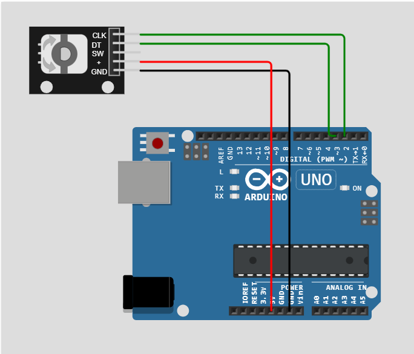

# Rotary encoder  

rotary encoder is a device made for measure the counts of the slot (pulses) and therefore the distance and therefore the velocity 

## main parts of code

to interrupt the code and make it execute the mentioned function whenever the pulse is changing (CHANGE) [from high to low or vice versa]

    // attach interrupt attaches a function to work whenever a change is done in the pin_a of the encoder
    attachInterrupt(digitalPinToInterrupt(encoder_pin_a), pin_a_trigger , CHANGE);

the function to be executed in which the counts (of pulses) increases (if the motor rotates in a specific direction) or   decreases (if the motor rotates in the opposite direction) 

    void pin_a_trigger(){

    if (digitalRead(encoder_pin_a) != digitalRead(encoder_pin_b)){
        doubled_counter ++;
    }
    
    else{
        doubled_counter --;
    }

    }

## Simulation (press images 😉)

- ### tinkercad
    I have added some features (commented with "for simulation" comment in the source code) to the main program to control the rotation of the motor and its speed so if you are not interested in how it was made you can skip every part commented with "for simulation"

    

- ### WOKWI

    